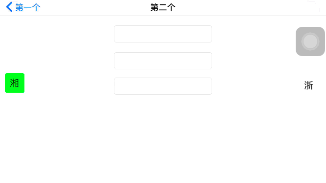

# WJLicensePlateKeyboard
自定义的车牌号码输入键盘，支持横竖屏模式，支持省份简称汉字，英文字母，数字的输入，输入时可以播放音效。


### 如何使用

```objc
#import "ViewController.h"
#import "WJLicensePlateKeyboard.h"

@interface ViewController ()
@property (weak, nonatomic) IBOutlet UITextField *inputField2;
@property (strong, nonatomic) WJLicensePlateKeyboard *keyBaord;
@end

@implementation ViewController

- (void)viewDidLoad {
    [super viewDidLoad];
    
    WJLicensePlateKeyboard *keyBaord = [[WJLicensePlateKeyboard alloc] init];
    keyBaord.inputTextView = _inputField2;
    _keyBaord = keyBaord;
}
@end
```

+ 方式1.下载源码，把`WJLicensePlateKeyBoard`文件夹拖到项目中，
  + `Destination` 勾选 `Cope items if needed`
  + `Added folders` 选择 `Create groups`

+ 方式2. 通过 `Cocoapods` 安装

  ```ruby
  platform :ios, '8.0'
  target 'Your Target' do
  
  pod 'WJLicensePlateKeyboard'
  
  end
  ```

### 效果图




